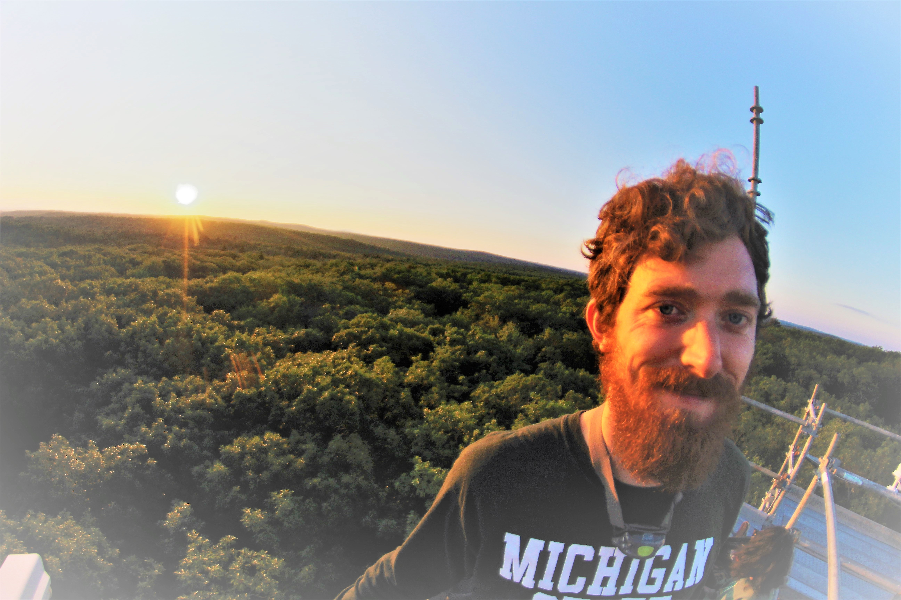

I am a PhD student in the [Department of Geography, Environment, and Spatial Sciences at Michigan State University](http://geo.msu.edu/). I'm also a member of [Dr. Kyla Dahlin's](http://geo.msu.edu/people/dahlin-kyla/) [ERSAM LAB](https://www.ersamlab.com/).

I earned my [B.S. in Resource Conservation](https://www.cfc.umt.edu/undergrad/rc/default.php) and a [certificate in GIS Science and Technologies](https://www.cfc.umt.edu/giscertificate/) from the [University of Montana's College of Forestry](https://www.cfc.umt.edu/default.php) in 2015. During and following my undergraduate work, I worked on [vegetation monitoring projects in the Northern Rockies](https://www.blm.gov/montana-dakotas), as a [cartographer for an international NGO](https://www.panthera.org/), as an [office support staff for a Wilderness training center](https://carhart.wilderness.net/), and at [a cheese store](https://www.goodfoodstore.com/Departments/Cheese/).

My research examines the influences of environmental and anthropogenic controls on terrestrial ecosystem processes through the use of hyperspectral and LiDAR remote sensing, spatial statistics, ecological modeling, and field sampling. I approach this research in two main ways. First, by examining forest functional and structural trait diversity in temperate closed-canopy forests via field sampling, remote sensing, and ecological modeling. Second, by investigating how environmental controls and anthropogenic changes affect these traits and the processes they drive at a landscape scale through the use of spatial statistics.

I primarily use the programming language R for my research, but I also dabble in Python from time to time. While much of my research is focused on using computers to ask ecological questions, I always look forward to summertime, when I conduct field research at sites throughout the Eastern U.S. 

When I am not out in the woods or writing code in front of the computer, I like to spend my time riding bicycles, exploring Michigan, and playing my bass a bit too loud.
