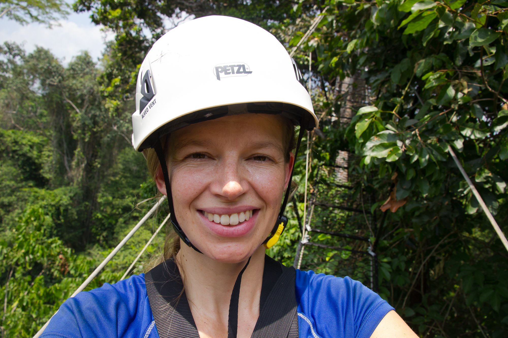

I am a broadly trained ecosystem ecologist, driven to understand the fate of global forests in the face of climate and land-use change. A particular focus is on the forests of the Amazon basin, which constitute the world’s largest intact tropical rainforest and are critical to global climate function and biodiversity, as well as providing many other ecosystem services. But the future of these forests, and the carbon they contain, is highly uncertain. My work aims to resolve key uncertainties associated with the responses of tropical forest structure and function to climate change (high temperatures and drought), with an increasing focus on human-modified forests. I am also developing research projects closer to home - in the UK and Wales specifically. I use a variety of approaches, from remote sensing to field observations, within the context of large, international collaborations.

In August 2022 I started my position as a Lecturer in Forest Sciences at [Bangor University's School of Natural Sciences](https://www.bangor.ac.uk/sns). Previously I was a Senior Research Associate at the Deptartment of Forestry, Michigan State University (USA) working in [Scott Stark's Tropical Forest Ecology lab](https://www.canr.msu.edu/people/sstark). I got my PhD in the Dept of Ecology and Evolutionary Biology at the University of Arizona, advised by [Scott Saleska](https://saleskalab.org/). 

## Contact

[Bangor University page](https://www.bangor.ac.uk/staff/natural-sciences/marielle-smith-593809/en)
Email: marielle.smith@bangor.ac.uk
Twitter: @marielle_smith1

